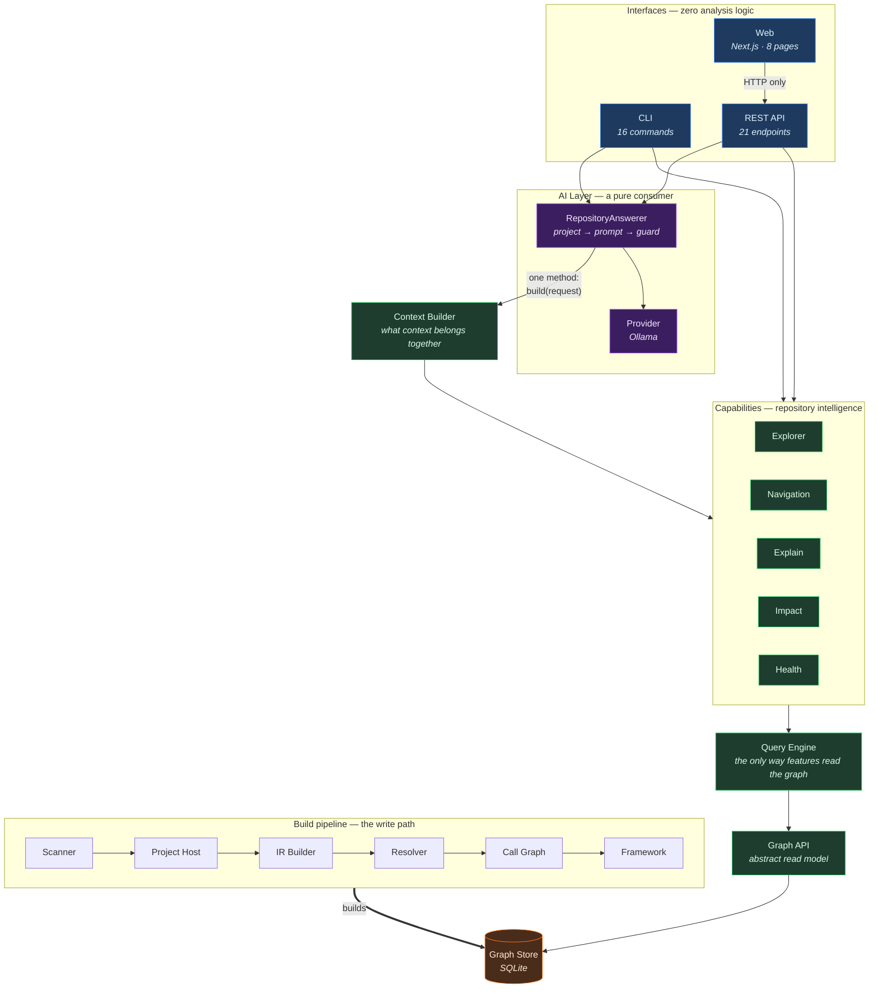
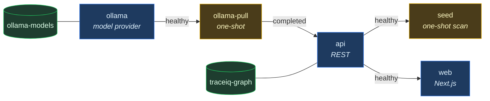

<div align="center">

# TraceIQ

### Know Your Codebase.

**A repository intelligence platform for TypeScript.** It reads your code once, stores what it found
as a queryable knowledge graph, and answers questions about it — through a web app, a REST API, a
CLI, and a chat that cites its sources.

[Quick Start](#quick-start) · [Architecture](#architecture) · [AI Layer](#the-ai-layer) · [Repository Chat](#repository-chat) · [Development](#local-development)


</div>

---

```
git clone <repo> && cd traceiq && docker compose up
```

Open **http://localhost:3001**. TraceIQ scans itself on first run, so the dashboard has real data the
moment it loads.

---

## Why TraceIQ

Most tools that answer questions about a codebase re-read the source every time you ask. TraceIQ
analyses once and stores the result, so every feature — navigation, impact analysis, health
reporting, chat — reads the same structured knowledge instead of re-deriving it.

**The engine is the product. AI is a consumer of it.** Answers are assembled from graph facts and
cite them; nothing is guessed, ranked or scored.

Three properties hold throughout:

| | |
|---|---|
| **Deterministic** | The same repository produces the same graph and the same answers, byte for byte. No timestamps in payloads, no ranking, no scoring anywhere. |
| **Honest about limits** | Every result carries the analysis's own limitation codes. A capped list reports its exact total, so a cap is never silent. |
| **Grounded** | Every value shown traces to a graph fact with a provenance and a confidence level. Nothing is invented. |

---

## Features

<table>
<tr><td width="33%" valign="top">

### 🔍 Explore
Browse packages, files and declarations in a three-pane explorer. Everything the graph records about
one symbol on a single page — callers, callees, references, roles, routes, environment variables,
provenance.

</td><td width="33%" valign="top">

### 💥 Impact
What breaks if you change this? Direct and indirect dependents, never merged, plus the relationships
the analysis could not resolve — reported as UNKNOWN rather than as absence.

</td><td width="33%" valign="top">

### 🩺 Health
Coupling, cycles, hotspots, coverage, isolated declarations. Findings are measured facts with
evidence, not opinions and not a score.

</td></tr>
<tr><td valign="top">

### 🕸 Architecture
Package dependency graphs, role trees and cycle detection, drawn with a deterministic layered
layout — the same input always draws the same picture.

</td><td valign="top">

### 💬 Chat
Ask questions in plain language. Every answer cites the facts it used, shows what was left out, and
carries a verdict saying whether it stayed inside them.

</td><td valign="top">

### 🔌 Three interfaces
A web app, a 21-endpoint REST API with a generated OpenAPI 3 document, and a 16-command CLI. All read
the same engine; none contains analysis logic.

</td></tr>
</table>

### What TraceIQ knows about a repository

| | |
|---|---|
| **16 node kinds** | `File` `Class` `Interface` `TypeAlias` `Enum` `EnumMember` `Function` `Method` `Property` `Accessor` `Constructor` `Variable` `Namespace` `Route` `EnvironmentVariable` `External` |
| **13 relationships** | `DECLARES` `IMPORTS` `EXPORTS` `CALLS` `IMPLEMENTS` `EXTENDS` `REFERENCES_TYPE` `HANDLED_BY` `READS` `WRITES` `DEPENDS_ON` `CONTINUES_TO` `TESTS` |
| **4 confidence levels** | `CERTAIN` `RESOLVED` `INFERRED` `AMBIGUOUS` — a closed vocabulary, never a number |
| **6 roles** | `Controller` `Service` `Repository` `Middleware` `Model` `Test` — annotations on a declaration, not node types |

---

## Architecture

Every layer reads only the layer beneath it. The engine is a pipeline; the interfaces are adapters
over it.



### The boundaries that matter

These are enforced by types and asserted by tests, not maintained by discipline:

- **The web app imports no backend package.** Its only contract is the REST surface; its types are a
  hand-written projection of the wire format.
- **The AI layer cannot reach the repository.** It receives a `ContextSource` with exactly one
  method. No SQLite, no graph traversal, no Query Engine, no capability call — its compiled output
  imports no `@traceiq` module at all.
- **No vendor name appears above the provider package.** `@traceiq/ai` names none; a test asserts it,
  including in the published type declarations.
- **Interfaces contain zero analysis.** Every endpoint and every command validates input, calls one
  capability, and returns its result unchanged.

---

## Repository structure

```
traceiq/
├── apps/
│   ├── api/                REST API — Express, 21 endpoints, OpenAPI 3
│   ├── cli/                CLI — 15 report commands plus an interactive chat REPL
│   └── web/                Web app — Next.js 15, React 19, 8 pages
│
├── packages/
│   │                       ── write path ──────────────────────────────
│   ├── scanner/            repository walk, project type, framework detection
│   ├── project-host/       owns the ts-morph Project
│   ├── ir/                 syntax → language-independent IR
│   ├── resolver/           binds references to declarations
│   ├── call-graph/         static CALLS relationships
│   ├── framework/          Express conventions: routes, roles, env vars
│   ├── graph/              graph builder + SQLite store
│   │
│   │                       ── read path ───────────────────────────────
│   ├── graph-api/          the only read path to the graph (abstract)
│   ├── query/              query engine — every feature reads through this
│   ├── explain/            every fact about one declaration
│   ├── impact/             dependents closure for a change
│   ├── health/             repository-wide health report
│   ├── explorer/           the read layer every interface consumes
│   ├── navigation/         routes, architecture trees, dependency navigation
│   ├── pipeline/           scan and open a stored graph
│   ├── context/            what context belongs together for a question
│   │
│   │                       ── AI ──────────────────────────────────────
│   ├── ai/                 grounded answers over projected context
│   ├── ai-ollama/          the first model provider
│   │
│   ├── analysis/           a GitHub URL → clone → the pipeline, as a tracked job
│   │
│   ├── shared/             stable identifiers, path rules
│   └── types/              domain vocabulary
│
├── docker/                 model pull and first-run scan
├── docs/progress.md        the full engineering record, milestone by milestone
└── docker-compose.yml
```

Each package documents its own purpose, boundaries, performance and limitations in its `README.md`.

---

## Quick Start

**Requirements:** Docker. Nothing else.

```bash
git clone <repo>
cd traceiq
docker compose up
```

| | |
|---|---|
| **Web** | http://localhost:3001 |
| **REST API** | http://localhost:3000 — try `/overview`, `/openapi.json` |
| **Ollama** | http://localhost:11434 |

The first `up` builds two images, starts the services, and **scans this repository into its own
graph** — so the dashboard opens on real data. A few minutes the first time, seconds after that.

Everything binds to `127.0.0.1`. Nothing in this stack authenticates, so none of it should be
reachable from a network.

### Try the API

```bash
curl localhost:3000/overview | jq '.data.repository'
curl localhost:3000/health   | jq '.data.findings[0]'
curl 'localhost:3000/search?q=Repository' | jq '.data.total'
```

### Analysing your own repository

```bash
TRACEIQ_SCAN_PATH=/path/to/your/repo docker compose up

# Rescan into the existing graph. `seed` skips itself when a graph is already there,
# so a rescan has to be asked for.
docker compose run --rm -e TRACEIQ_SCAN_FORCE=1 seed
```

Any repository works, in any language. TypeScript, JavaScript, Python, Java and Go reach semantic
depth; everything else is described by universal discovery — files, languages, manifests, declared
dependencies and detected technologies — and the analysis says which it got. No `tsconfig.json` is
required. The path is mounted **read-only** — TraceIQ never writes to the code it analyses.

---

## Docker deployment

Five services, started in dependency order, each gated on the one before it being *healthy* rather
than merely started.



Both application images are multi-stage and run as an unprivileged user with no compiler in the
runtime layer. The graph and any downloaded models live in named volumes and survive
`docker compose down`.

```bash
docker compose up            # the whole stack
docker compose build         # rebuild after a source change
docker compose logs -f api   # follow one service
docker compose down          # stop; volumes kept
docker compose down -v       # stop and discard the graph and models
```

### Configuration

Every variable has a working default, so no `.env` is needed. Copy `.env.example` to change
something.

| Variable | Default | Purpose |
|---|---|---|
| `TRACEIQ_MODEL` | *(empty)* | Which model answers. Empty means chat is disabled. |
| `TRACEIQ_PROVIDER` | `ollama` | Which provider holds it. |
| `TRACEIQ_SCAN_PATH` | `.` | The repository to analyse, on the host. Mounted read-only. |
| `WEB_PORT` | `3001` | |
| `API_PORT` | `3000` | |
| `OLLAMA_PORT` | `11434` | |
| `TRACEIQ_API_URL` | `http://api:3000` | Where the browser's `/api/*` calls go. **Build-time** — see below. |

> **Chat is opt-in.** `TRACEIQ_MODEL` is empty by default because a model is several gigabytes, and a
> first `docker compose up` should not open with a download nobody asked for. Everything else works;
> the chat page says `ai-not-configured` and what to do. Set the variable and run `up` again — the
> model is pulled once, into a persistent volume, and the API waits for it to finish.

> **`TRACEIQ_API_URL` is a build-time value.** Next compiles its rewrites into the build, so changing
> it requires `docker compose build web`. Setting it on a running container has no effect.

---

## Local development

**Requirements:** Node ≥ 22, pnpm 11.

```bash
pnpm install
pnpm build                   # tsc -b across the workspace; also the typecheck for sources
pnpm test                    # 2,128 tests, run against sources — no build required
```

### The CLI

```bash
mkdir -p .traceiq                            # the store writes the file, not the directory
node apps/cli/bin/traceiq.js scan .

node apps/cli/bin/traceiq.js overview
node apps/cli/bin/traceiq.js symbol 'sym:packages/query/src/query-engine.ts#QueryEngine'
node apps/cli/bin/traceiq.js impact 'sym:packages/types/src/node-id.ts#NodeId'
node apps/cli/bin/traceiq.js health
```

The `mkdir` is needed the first time: the graph store opens a database file but does not create the
directory above it, so a missing `.traceiq/` reports `the database could not be opened`. Docker is
unaffected — its volume is mounted, so the directory is always there.

<details>
<summary><b>All 16 commands</b></summary>

| Command | What it answers |
|---|---|
| `scan <repository>` | Build the repository graph and store it |
| `overview` | Repository, graph and health summary |
| `architecture` | Roles, kinds and package dependencies |
| `packages` | Every derived package with counts both ways |
| `package <name>` | One package: files, dependencies, roles |
| `file <path>` | One file: declarations, imports, routes |
| `symbol <id>` | Everything recorded about one declaration |
| `impact <id>` | What a change to one declaration could affect |
| `routes` | Every route the repository registers |
| `route <method> <path>` | One route: chain, roles reached, health |
| `health` | Architectural health report |
| `search <text>` | Exact or prefix search, alphabetical |
| `dependencies <id>` | Direct and transitive dependencies |
| `cycles` | Import, call, reference and inheritance cycles |
| `hotspots` | The most connected declarations and files |
| `chat` | Interactive, grounded, cited — see below |

Options: `--db <path>`, `--profile`. Errors carry a fixed code and a distinct exit status, so a script
can branch on the status without matching prose.

</details>

### Running the API and web app directly

```bash
# terminal 1
TRACEIQ_DB=.traceiq/graph.db node apps/api/bin/traceiq-api.js

# terminal 2
pnpm --filter @traceiq/web dev        # http://localhost:3001
```

### Scripts

| | |
|---|---|
| `pnpm build` | `tsc -b` across the workspace |
| `pnpm test` | Backend and web suites |
| `pnpm test:backend` / `pnpm test:web` | One at a time |
| `pnpm typecheck:tests` | Typechecks test files, which the build excludes |
| `pnpm typecheck:web` / `pnpm build:web` | The web app specifically |
| `pnpm clean` | `tsc -b --clean` |

---

## The AI layer

TraceIQ's AI is a **pure consumer** of the engine. It cannot traverse the graph, reach SQLite, call a
capability or search the repository — it receives assembled context and nothing else.

### The problem it solves

A `RepositoryContext` cannot go in a prompt. Measured on TraceIQ itself:

| Context | Size | ≈ tokens | vs a 128k window |
|---|---|---|---|
| `symbol` | 621 KB | 176,712 | 1.3× |
| `repository` | 1,450 KB | 412,508 | 3.1× |
| `impact` | 4,201 KB | 1,194,962 | **9.1×** |

So the heart of the AI layer is a **projection**: a deterministic, budgeted, citable reduction of a
context into facts a model can actually be given.

| Context | ≈ tokens in | projected | reduction | facts | warm |
|---|---|---|---|---|---|
| `repository` | 412,508 | 1,920 | **215×** | 64 | 0.10 ms |
| `impact` | 1,194,962 | 5,989 | **200×** | 152 | 0.12 ms |
| `symbol` | 176,712 | 5,995 | 29× | 166 | 0.16 ms |

### How an answer is produced

```mermaid
flowchart LR
    Q["question +<br/>resolved subject"] --> ACQ["acquire<br/><i>ContextSource.build()</i>"]
    ACQ --> PROJ["project<br/><i>fixed priority, capped</i>"]
    PROJ --> ASM["assemble<br/><i>deterministic prompt</i>"]
    ASM --> GEN["generate<br/><i>streaming only</i>"]
    GEN --> GUARD["guard<br/><i>closed identifier set</i>"]
    GUARD --> A["answer +<br/>citations + verdict"]

    classDef det fill:#1e3d2f,stroke:#22c55e,color:#dcfce7
    classDef gen fill:#3b1e5f,stroke:#a855f7,color:#f3e8ff
    class ACQ,PROJ,ASM,GUARD det
    class GEN gen
```



Everything except generation is deterministic, so an unexpected answer can be investigated by
re-projecting and comparing digests.

### Four rules the projection holds

1. **Fixed priority, never ranking.** Extractors run in a declared order with declared caps. No
   relevance score exists anywhere in TraceIQ and none is invented.
2. **Nothing is invented.** A fact restates one edge or one field the context already carried. Where
   the graph recorded an edge whose other end it could not name, the fact is simply absent.
3. **A cap is never silent.** Every part reports what it kept against its exact total, and those
   omissions reach the prompt *and* the user.
4. **Byte-identical output.** The same context and budget produce the same facts and the same prompt.

### The grounding guard

This is where "grounded only in the repository" becomes *checkable*. Every graph identifier carries a
fixed prefix, so for a given projection the permitted set is **closed and known** — any
identifier-shaped token in an answer outside that set is a fabrication, decided deterministically with
no model involved.

| Verdict | Meaning |
|---|---|
| `grounded` | At least one valid citation, nothing fabricated |
| `ungrounded` | Named an identifier or fact id that does not exist |
| `unverifiable` | Nothing fabricated, but nothing cited — so nothing could be checked |

An ungrounded answer is **shown**, with its verdict and the fabrications named. Withholding it would
hide the evidence of the failure.

*What the guard cannot do:* catch a wrong claim about a real identifier. It catches invented symbols,
which is the failure that destroys trust fastest, and it does not pretend to be more than that.

### Provider-agnostic

`RepositoryAnswerer(contextSource, model)` — constructor injection is the entire configuration
surface. No registry, no vendor setting. Ollama is the first provider and lives in a separate package
downstream of the abstraction, so non-leakage is structural rather than conventional.

Reachable without changing `@traceiq/ai`: llama.cpp, LM Studio, vLLM, Anthropic, OpenAI.

---

## Repository Chat

Ask questions in plain language. Every answer shows its evidence *before* its prose.

A real session, captured during development — so its figures are that day's graph, not what a fresh
scan of the current tree reports:

```
> How large is this repository and what limits the analysis?

64 facts · 1,920 tokens · tier standard · c0a8bdfbb1fe2e3f
  externalPackages: showing 15 of 51
  cycles: showing 15 of 18

The repository contains 228 files and 3,148 declarations [f2, f3]. The analysis has
several limitations that affect its comprehensiveness:

- Call Coverage: the call graph binds names rather than symbols, so a callee containing
  another call produces no edge; every call-graph figure is a lower bound [f8].
- Unresolved Relationships: many relationships the pipeline could not resolve are absent
  from the graph, making any count of references a lower bound [f22].

verdict grounded · qwen2.5:7b-instruct · 2005 prompt / 197 output tokens
  [f2]  repository contains 228 files                @traceiq/explorer
  [f3]  repository contains 3148 declarations        @traceiq/explorer
  [f8]  analysis limitation call-coverage-partial…   @traceiq/context
```

Available in all three interfaces:

```bash
# CLI — interactive, streaming, coloured citations, Ctrl+C cancels one answer
node apps/cli/bin/traceiq.js chat --model qwen2.5:7b-instruct
node apps/cli/bin/traceiq.js chat --model qwen2.5:7b-instruct \
  --subject 'impact:sym:packages/types/src/node-id.ts#NodeId'

# REST — one JSON answer, or server-sent events
curl -X POST localhost:3000/chat -H 'content-type: application/json' \
  -d '{"question":"What would break if I changed this?",
       "subject":{"kind":"impact","id":"sym:src/svc.ts#run"}}'

curl -N -X POST localhost:3000/chat/stream -H 'content-type: application/json' \
  -d '{"question":"How large is this repository?","subject":{"kind":"repository"}}'
```

**The web app** at `/chat` adds a conversation sidebar, streaming with markdown rendering, subject
selection through the search endpoint, a grounding badge, an omission summary, token usage, Stop,
Retry and Clear.

### Two things chat will not do

**It will not search for you.** Turning free text into a subject is repository search — that belongs
to the Explorer, and doing it inside the AI path would put repository intelligence there. The web app
resolves a subject through `GET /search` and sends the result; the CLI takes a prefixed identifier;
the API refuses a bare string.

**It has never seen your source code.** No layer below the AI serves file contents. Facts are
identifiers, relationships, counts and the limitations of the analysis. A test asserts that no source
text reaches a prompt.

---

## Technologies

<table>
<tr><td valign="top" width="50%">

**Engine**

| | |
|---|---|
| TypeScript | 7.0 · strict, project references |
| ts-morph | 28 · TypeScript Compiler API |
| better-sqlite3 | 13 · one database per repository |
| fast-glob | 3 · repository walk |

**Interfaces**

| | |
|---|---|
| Express | 5 · REST API |
| Next.js | 15 · App Router |
| React | 19 |
| Tailwind CSS | 4 · CSS-first config |

</td><td valign="top" width="50%">

**Web app**

| | |
|---|---|
| shadcn/ui | copy-in, over Radix |
| TanStack Query | 5 · server state |
| Zustand | 5 · UI state |
| React Flow | 12 · graph rendering |
| Monaco | payload inspection |

**AI · tooling**

| | |
|---|---|
| Ollama | the first provider |
| Vitest | 4 · 2,128 tests |
| pnpm | 11 · workspaces |
| Docker Compose | 5 services |

</td></tr>
</table>

**The AI layer has zero external runtime dependencies.** No SDK, no tokeniser library, no markdown
library, no HTTP client — Node's own `fetch` and streams are enough.

The engine is nearly as lean: every package below the web app depends on **four** external runtime
packages in total — `better-sqlite3`, `ts-morph`, `fast-glob`, `express`. The web app is where the
dependencies live, as a frontend's are.

---

## Testing

```bash
pnpm test              # 2,128 tests across 84 files
pnpm test:backend      # 1,868
pnpm test:web          #   260
```

| Layer | Approach |
|---|---|
| **Unit** | Every package against fabricated inputs — no graph, no database, no compiler in the file. If a package works from fakes, it provably reaches nothing. |
| **Integration** | Each capability also runs over a **real scanned repository** through the pipeline, so a passing unit test cannot be an artefact of the fakes. |
| **Boundary** | Architecture rules asserted mechanically against source *and* build output: no forbidden import, no vendor name in published types, no control byte in a source file. |
| **HTTP** | A real server on an ephemeral port driven with `fetch` — routing, validation, SSE framing, status codes, error translation. |
| **Component** | The web app's accessible tree (`getByRole`, `aria-*`, `alert`, `status`), not class names. Only `fetch` is stubbed; every layer above it is production code. |
| **Determinism** | The same input produces byte-identical output — graphs, contexts, projections, prompts. |
| **Live, opt-in** | One suite against a real Ollama, skipped unless `TRACEIQ_OLLAMA_LIVE=1`. Never in CI. |

**Deliberately not tested:** whether a given model writes a good answer. That is model evaluation, it
needs labelled data, and a test that asserted it would be asserting a hope.

Validated against itself throughout — 330 files, 4,009 declarations, 16,845 edges.

---

## Roadmap

**v1.0.0 — shipped.** The engine, three interfaces, the AI layer, Repository Chat, and a one-command
deployment.

<details open>
<summary><b>Delivered</b></summary>

Repository Scanner · Project Host · IR Builder · Resolver · Framework Extractor · Call Graph · Graph
Builder · Graph Store · Graph API · Query Engine · Explain Symbol · Impact Analysis · Repository
Health · Repository Explorer · Repository Navigation · Pipeline · CLI · REST API · Web Frontend ·
Context Builder · AI Layer · Repository Chat · Release Engineering

</details>

**Next, in rough order of value:**

| | |
|---|---|
| **Answer evaluation** | The one thing no test asserts. Needs a labelled question set; would make model and prompt changes measurable rather than felt. |
| **A graph revision identifier** | The read API exposes none, so staleness cannot be detected exactly. A small additive change that would let a conversation know its facts had moved. |
| **Conversation persistence** | The types are in place. The real question is what happens to a stored conversation after a rescan — likely: mark turns stale rather than silently replay them. |
| **More languages** | The graph vocabulary is language-independent by design; the IR builder is not. Python or Go would be a second IR builder, not a second engine. |
| **More frameworks** | Route and role extraction currently understands Express conventions. NestJS and Fastify are additive. |
| **More providers** | The contract battery already exists, so a second provider inherits the whole standard. |
| **Images in CI** | `docker build` in the workflow — release engineering found three defects that only a real build surfaces. |
| **Incremental scanning** | Rescanning is whole-repository. Identity is location-derived, so a rename reads as a delete plus a create. |

---

## Documentation

| | |
|---|---|
| **`docs/progress.md`** | The full engineering record — every milestone, every defect found and fixed, every measurement, every decision and why |
| **`packages/*/README.md`** | Per-package purpose, boundaries, performance, limitations |
| **`apps/*/README.md`** | Interface reference for the API, CLI and web app |
| **`/openapi.json`** | Generated from the endpoint table, so it cannot drift from the routes |
| **`.env.example`** | Every configuration variable |

---

## License

**Not yet chosen.** There is no `LICENSE` file and no `license` field in `package.json`, so the
default applies: all rights reserved, and no permission is granted to use, copy, modify or distribute
this code.

If TraceIQ is meant to be open source, add a `LICENSE` file and a `license` field. That is the owner's
decision to make rather than one to infer, so nothing has been assumed here.

---

<div align="center">

**TraceIQ** — static analysis only. Every value shown exists in the repository graph.

</div>
